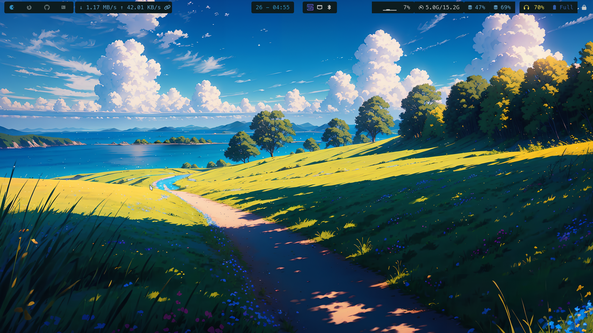
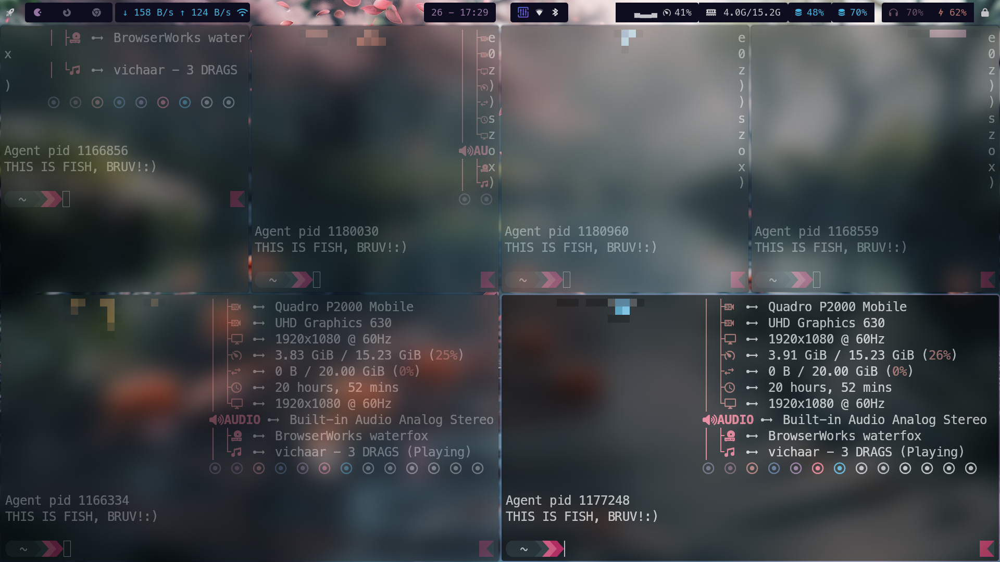

# =====================================
#            nix-ste
# =====================================

Welcome to **nix-ste**! This is a complete, modern, and beautiful configuration for NixOS Linux, designed to make your desktop powerful, productive, and visually stunning.

## What Are Dotfiles?
Dotfiles are configuration files for your Linux system and applications. By keeping them in one place, you can:
- Reproduce your setup on any machine
- Share your workflow and style
- Easily back up and version your configs
- Learn from and contribute to the Linux community

This repo is a collection of dotfiles and scripts for NixOS, with a focus on:
- Declarative, reproducible system setup (using Nix flakes)
- Modern Wayland/X11 desktop (Hyprland, Qtile)
- Themed terminals, bars, launchers, and more
- Secure Boot support
- Productivity and development tools

---

## Screenshots
See what your system can look like with these configs!

**Screenshots Folder:** [`screenshots/`](./screenshots/)

| Hyprland Desktop | Qtile Desktop | Themed Terminal |
|------------------|--------------|-----------------|
|  |  |  |

> _Add your own screenshots to the `screenshots/` folder!_

---

## Why Use These Dotfiles?
- **Reproducibility:** Set up your system exactly the same, every time
- **Productivity:** Pre-configured tools, shortcuts, and scripts
- **Aesthetics:** Beautiful, consistent theming across all apps
- **Learning:** See real-world configs for NixOS, Hyprland, Qtile, Fish, and more
- **Security:** Secure Boot support out of the box

---

## Getting Started
### 1. Prerequisites
- A running NixOS system (preferably latest stable or unstable)
- Basic familiarity with the terminal
- (Optional) A GitHub account for forking/cloning

### 2. Clone the Repository
```sh
git clone https://github.com/yourusername/nix-ste.git ~/nix-ste
cd ~/nix-ste
```

### 3. Review and Run the Setup Script
This script will symlink configs to `~/.config` and NixOS configs to `/etc/nixos`.
```sh
./scripts/configuring_dotfiles.sh
```
- **Tip:** Open the script in your editor to see exactly what it does!

### 4. Rebuild Your System (NixOS Only)
```sh
sudo nixos-rebuild switch --flake ~/nix-ste/nixos#nix-ste
```

### 5. Log Out and Back In
Your new desktop environment, shell, and tools should be ready!

---

## Configuration Overview
This repo configures:
- **NixOS**: System, packages, hardware, Secure Boot (see `nixos/`)
- **Hyprland**: Modern Wayland compositor (see `hypr/`)
- **Qtile**: Python-based tiling window manager (see `qtile/`)
- **Fish Shell**: User-friendly shell with custom aliases/functions (see `fish/`)
- **Starship**: Fast, informative prompt (see `starship.toml`)
- **Terminals**: Kitty, Alacritty, Foot (see their folders)
- **Waybar**: Status bar for Wayland (see `waybar/`)
- **Rofi**: Launcher and menu (see `rofi/`)
- **Picom**: X11 compositor for effects (see `picom/`)
- **Mako**: Wayland notifications (see `mako/`)
- **Wlogout**: Themed logout menu (see `wlogout/`)
- **Fastfetch**: System info with custom ASCII logo (see `fastfetch/`)
- **Pywal**: Dynamic color schemes (see `wal/`)
- **Scripts**: Installers, automation, anime streaming (see `scripts/`)

Each folder contains configs and themes for that app. You can customize them to your liking!

---

## Main Packages & Tools
A few highlights (see `nixos/configuration.nix` for the full list):
- **Window managers:** hyprland, qtile
- **Terminals:** alacritty, kitty, foot
- **Shell:** fish, starship
- **Status bar:** waybar
- **Launcher:** rofi-wayland
- **Compositor:** picom
- **Notifications:** mako
- **Logout:** wlogout
- **Browsers:** google-chrome, zen-browser
- **Editors:** code-cursor, vim, neovim
- **Dev tools:** python3, nodejs_24, go, rustc, pipx, language servers, gdb, postgresql
- **Media:** vlc, mupdf, pavucontrol
- **Bluetooth:** blueman, bluez
- **Fonts:** meslo-lgs-nf, nerd-fonts
- **Other:** fastfetch, lazygit, networkmanager, grim, slurp, swww, etc.

---

## Customization Tips
- **Change themes:** Edit the relevant config files in each app's folder
- **Add your own scripts:** Place them in `scripts/` and symlink as needed
- **Update packages:** Edit `nixos/configuration.nix` and rebuild
- **Try different window managers:** Switch between Hyprland and Qtile in your NixOS config

---

## Troubleshooting
- If something doesn't look right, check the logs for each app (e.g., `journalctl`, `~/.local/share/waybar/waybar.log`)
- Make sure all dependencies are installed (see package list above)
- For NixOS-specific issues, consult the [NixOS Manual](https://nixos.org/manual/)
- For Secure Boot, see Lanzaboote docs and NixOS wiki

---

## License & Attribution
- **Repository License:** GPL-3.0 (see [LICENSE](LICENSE))
- **ani-cli:** GPL-3.0, included as `scripts/ani-cli`
- Other configs/scripts may have their own licenses; see individual files
- If you use or redistribute, please respect third-party licenses

---

## Contributing & Support
- **New to dotfiles?** Fork this repo and make it your own!
- Issues and PRs welcome! Please open an issue for bugs, suggestions, or questions
- For NixOS help: [NixOS Discourse](https://discourse.nixos.org/), [NixOS Manual](https://nixos.org/manual/)
- For ani-cli: [ani-cli GitHub](https://github.com/pystardust/ani-cli)

---

**Enjoy your reproducible, beautiful, and powerful Linux setup!**

---

## Screenshots Folder
Create a folder named `screenshots/` in the root of this repo and add your PNG/JPG images. Reference them in the table above for a visual showcase! 